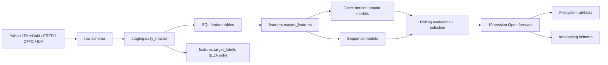

# System Architecture

## Phạm vi

Hệ thống là batch forecasting pipeline cho dữ liệu daily. PostgreSQL xử lý
storage/feature engineering; Python điều phối API, training và observability.

## Thành phần

| Layer | Trách nhiệm |
|---|---|
| `config/` | Cấu hình tập trung, paths, tickers, model constants |
| `src/data/ingestion/` | API clients, normalization, raw upsert |
| `src/data/storage/` | PostgreSQL connection, schema/SQL runners |
| `sql/schema/` | DDL raw, staging, features, forecasting |
| `sql/features/` | Feature và target generation |
| `src/pipelines/` | Orchestration, validation, EDA, environment checks |
| `src/modeling/` | Leakage guards, sequence/direct models, forecast formatting |
| `src/experiments/` | Run ID, file/DB persistence, metadata |
| `scripts/` | CLI entrypoints |

## Quyết định kiến trúc

- Không dùng Spark: dữ liệu daily từ 2010 chỉ vài nghìn dòng.
- Không dùng Polars trong production path: bottleneck là network, SQL và deep
  training; đổi DataFrame engine không tạo lợi ích đáng kể ở quy mô này.
- Không import logic production từ `scripts/`; scripts chỉ là thin CLI.
- Sequence và tabular models dùng chung một forecast contract, rolling origins,
  horizons và artifact registry.
- Feature SQL có thứ tự cố định để reproducible.
- Forecasting history tách schema và không bị full refresh xóa.

## Boundary

- Cutoff: sau phiên hiện tại.
- Prediction unit: một trading session.
- Target: vector 10 Open.
- Forecast date: business-day estimate, không phải CME calendar chính thức.
- Deployment hiện tại: batch/local; chưa có scheduler hay serving API.
